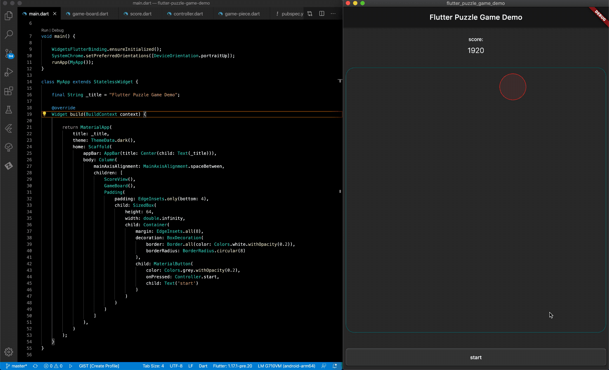

# flutter_puzzle_game_demo
An example project demonstrating how to make simple 2D puzzle games in Flutter

## Getting Started
To build and run this project, you'll need a Flutter environment and an emulator or device for testing.

Steps to build this project:
1. clone this repo
2. cd into project directory
3. `flutter pub get` to update packages
4. `flutter run` to build and run on an available device

Thanks for checking it out!